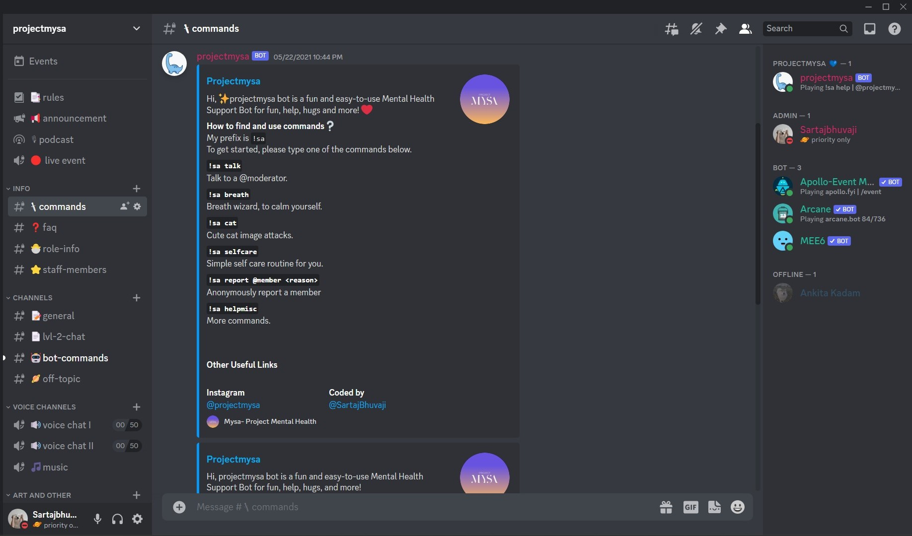

# Mental Health Bot for Discord (ig/@projectmysa )
```
A Discord bot designed to provide support and resources for individuals struggling with mental health. 
```

<div align = "center" >
  

  


  
</div>


<table>

</table>  

## Add bot to Discord Server

[Add Bot Here!](https://discord.com/oauth2/authorize?client_id=838752435685687366&scope=bot&permissions=8) 

## Features
- Personalized responses and recommendations based on user input
- Commands for moderation, music playback, event hosting, announcements, and mini-games
- Daily check-ins and access to mental health resources and helplines

## Tech Stack
- Node.js 
- Heroku

## Getting Started
1. Invite the bot to your Discord server by clicking [this link](https://discord.com/oauth2/authorize?client_id=838752435685687366&scope=bot&permissions=8) 
2. Use the `!sa help` command in any text channel to see a list of available commands.
3. Use our existing Discord server [template](https://discord.new/RDfBhgeCfhdg). 
4. If you just want to use the bot, we are all done!


## Development

To run the bot on your local machine, you'll need to have Node.js and npm installed. 

1. Clone the repository: 
([Clone here!](https://github.com/SartajBhuvaji/projectmysa-discord-bot)). 
2. Install dependencies:  `npm install`
4. Create an application ([Discord developer portal](https://discord.com/developers/docs/game-sdk/applications)).  
5.  Add a .env file with your Discord API key.
6. Start the bot: `npm start`

## Comamnds
`!sa help`, `!sa helpmod`, `!sa helpmisc`, `!sa talk`, `!sa easteregg`, `!sa play/stop/skip <URL>`, `!sa selfcare`, `!sa cat`

## Contribution

If you want to contribute to the project, please fork the repository and make a pull request with your changes. 

## Authors
- [Sartaj Bhuvaji](https://github.com/SartajBhuvaji)

## License
This project is licensed under the MIT License.
